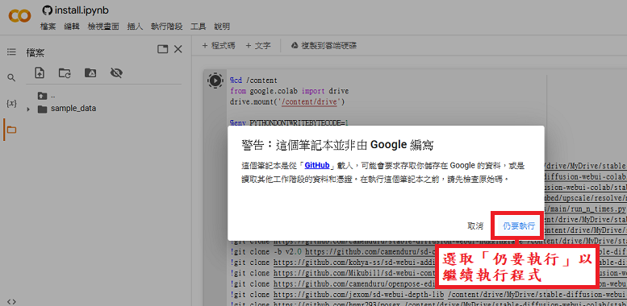

# Stable Diffusion WebUI的學習筆記

## 什麼是Stable Diffusion？

Stable Diffusion是由[StabilityAI](https://stability.ai/)、CompVis和Runway合作開發的開源軟體，旨在根據文字的描述來產生詳細圖像，並於二零二二年八月二十二日首次公開發佈。Stable Diffusion是「穩定的擴散」的意思，它使用擴散模型（diffusion model）的一種變體，稱為「潛擴散模型」（latent diffusion model; LDM）。因為擴散模型本身須反覆多次做順擴散和逆擴散的迭代運算，運算時間始終太長，並不切合實際使用。「潛擴散模型」是把順擴散和逆擴散運算改為在潛空間（latent space，也是「潛擴散」的意義）進行，而不在像素空間（pixel space）進行，使運算時間大大縮短，成為實用的運算法。

## 為什麼使用Stable Diffusion WebUI？

Stable Diffusion本身是行命令式的軟體，要讓它繪圖，便要在終端機視窗或命令提示字元視窗下繪圖指令，非常麻煩和痛苦。譬如要繪畫一隻花貓坐在生日蛋糕後面，可能要在終端機中輸入這樣的命令：

``python scripts/txt2img.py --prompt "a birthday cake is in front of a tabby cat" --ckpt sd-v1-4.ckpt --skip_grid --n_samples 4``

為此不少人開發了圖像化介面，以減少輸入命令的數量和輸入錯誤指令的機會。其中由AUTOMATIC1111開發的[Stable Diffusion WebUI](https://github.com/AUTOMATIC1111/stable-diffusion-webui)，使用網頁介面，可以在瀏覽器中指示核心程式工作，最受歡迎，所以我選用這個開源軟體作為Stable Diffusion的操作介面。

## 把Stable Diffusion WebUI安裝到自己的Google雲端硬碟裏

本開源軟體可以在Windows、Linux和Apple Silicon裏安裝，甚至可以在[Google Colaboratory](https://colab.research.google.com/)裏運行，本筆記以Google Colab為安裝目標，其他系統請參考Stable Diffusion WebUI的[GitHub網頁說明](https://github.com/AUTOMATIC1111/stable-diffusion-webui#installation-and-running)。

1. 為使之後的安裝過程順利，可以先[登入Google帳戶](https://accounts.google.com/)，並開啟[Google Drive頁面](https://drive.google.com/)。 
⚠️注意⚠️ 本軟體會安裝到Google Drive中，所以Google Drive必須有足夠的空間。如果使用免費帳戶，Google只提供15 GB的共用空間，GMail、Google相簿和Google Drive的內容都會計算在15 GB的容量內，可能會導致空間不足，所以如果使用免費帳戶的話，建議使用專用帳戶，只作Stable Diffusion WebUI之用，或者使用免安裝的方法，[可以參考下一節](README.md#%E6%9C%AA%E5%AE%89%E8%A3%9D%E6%AA%94%E6%A1%88%E5%88%B0google-drive%E8%A3%8F%E4%B9%8B%E4%BD%BF%E7%94%A8%E6%96%B9%E6%B3%95)。 
另外，Google Colab的官方推特在二零二三年四月二十一日提及[Google Colab無法負擔免費帳戶使用Stable Diffusion](https://twitter.com/thechrisperry/status/1649189902079381505)，所以如果使用免費帳戶的話，請自行衡量可能被禁用的風險。

1. 先到@camenduru的Stable Diffusion WebUI項目的[存儲庫主頁](https://github.com/camenduru/stable-diffusion-webui-colab/)。

1. 捲動網頁到下方，那裏列出各種安裝方法，包括安裝所有Stable Diffusion WebUI檔案到Google Drive中，再運行軟體的方法，或者不把檔案安裝到Google Drive中，直接運行軟體的其他方法。我們會把Stable Diffusion WebUI檔案安裝到Google Drive中，以便每次啟用都可以取得上一次的運行狀態，並可以安裝更多的插件使用，也讓產生的圖片可以儲存到Google Drive中。如果因為某些原因，例如只想體驗一下某Checkpoint模型的感受，未決定是否要使用它，或者Google Drive的空間不足，未能安裝軟體，[可以參考下一節](README.md#%E6%9C%AA%E5%AE%89%E8%A3%9D%E6%AA%94%E6%A1%88%E5%88%B0google-drive%E8%A3%8F%E4%B9%8B%E4%BD%BF%E7%94%A8%E6%96%B9%E6%B3%95)。

1. 轉到本項目的[drive分支頁](https://github.com/camenduru/stable-diffusion-webui-colab/tree/drive)，可以看到[把WebUI Colab安裝到Google Drive](https://github.com/camenduru/stable-diffusion-webui-colab/tree/drive#-install-the-webui-colab-to-google-drive)（🦒 Install the WebUI Colab to Google Drive）一節之下有三項： 

1. 首先要把WebUI Colab安裝到Google Drive裏，所以按一下第一列第一欄的，以在Google Colab中開啟install.ipynb檔。

1. 這時可以把install.ipynb儲存到自己的Google Drive之中，其他兩個Google Colab檔也可以儲存到Google Drive裏，以便之後使用。如要儲存檔案，可以用滑鼠按一下選單列左側的【檔案】→【在雲硬碟中儲存複本】： 
 
 
儲存複本之後，所有修改都會記錄下來，日後便可以再用，但是就算沒有儲存複本，還是可以進行安裝的。無論有沒有把複本儲存起來，後面的步驟均相同，但如果沒有儲存複本的話，每次都要回到Stable Diffusion WebUI項目的[分支主頁](https://github.com/camenduru/stable-diffusion-webui-colab/tree/drive)才能夠開啟軟體。

1. 準備好install.ipynb之後，便可以按一下程式碼儲存格左上角的播放鍵，儲存格內的程式碼便會開始執行。 

   - ⚠️如果未把複本儲存到自己的Google Drive裏，會出現警告視窗，請按「仍要執行」以繼續執行程式。 

1. 由於安裝程式要把檔案安裝到Google Drive中，所以必須允許程式取得Google Drive的讀寫權限。請按「連線至Google雲端硬碟」以繼續授權步驟。 

1. 在新開啟的視窗按一下自己的帳戶名稱，以確認使用本帳戶授權。 

1. 捲動到視窗底部，並按「允許」以完成授權步驟。 

1. 完成授權之後，程式便會繼續執行，請耐心等候約十數分鐘，以完成下載和安裝檔案的步驟。 

1. 待工作訊息欄內顯示「Installed」字樣，並且程式碼儲存格左上角回復播放鍵⏵狀態，便表示安裝或更新過程完成。 

1. 由於Google Colab裏的虛擬機是和其他虛擬機共用資源的，所以完成安裝軟體之後，便要盡快把虛擬機關掉，以釋放佔用的資源給其他人使用。按一下右上方的▼，以開啟【其他連線選項】選單，並且按一下【中斷連線並刪除執行階段】，以關閉現正使用的虛擬機。  記住，就算是在使用免費版本，也不要霸佔著共用資源不利用而空轉。如果長時間佔用資源，Google Colab可能會限制該帳戶之後的使用情況。

1. 這時會出現警告視窗，請按「是」以完成關閉程序。關閉之後，所有檔案會全部刪除。 

1. 返回[Google Drive主頁](https://drive.google.com/)，可以看到已新增了一個「stable-diffusion-webui-colab」目錄，表示已安裝好了Stable Diffusion WebUI軟體。日後執行本軟體時均會使用「stable-diffusion-webui-colab」目錄裏的檔案，所以切勿移動本目錄，也不要更改它的名字。另外可以看到，現在已經使用了超過8 GB的空間，佔用了超過一半的免費空間。  
⚠️注意⚠️ 安裝程式預設不會安裝ControlNet（用來控制人物姿勢的插件）。如果同時安裝ControlNet v1.1，耗用的空間會暴增至12 GB以上。

現在完成了第一部份，跟著我們看看如何打開軟體使用Stable Diffusion WebUI。

## 初次使用Stable Diffusion WebUI

我們下面使用的Stable Diffusion WebUI是英文介面，可是就算感到英語能力有點不足，也不用擔心，之後我會簡單介紹網頁裏各項目的意義。反而使用軟體繪圖時所撰寫的提示詞，要求的英語能力比較高，但是我們還是可以透過參考其他人寫好的提示詞，以及使用線上翻譯、ChatGPT等方法，寫出一些合乎自己所需的提示詞，說到底，繪畫最重要是創意，不管是用什麼方法和工具。

### 已把Stable Diffusion WebUI的所需檔案安裝到Google Drive裏之使用方法

1. 現在返回Stable Diffusion WebUI項目的[分支頁](https://github.com/camenduru/stable-diffusion-webui-colab/tree/drive#-install-the-webui-colab-to-google-drive)，按第二列的，以在Google Colab中開啟run.ipynb檔案。

1. 這時也可以把run.ipynb檔案儲存到自己的Google Drive之中，以便日後使用。由於每次啟動本軟體都要使用本檔案，所以最好還是儲存下來，放在方便自己找到的地方。

1. 準備好run.ipynb檔案之後，便可以按一下程式碼儲存格左上角的播放鍵，儲存格內的程式碼便會開始執行。 

1. 由於執行程式要讀寫Google Drive中的「stable-diffusion-webui-colab」目錄，所以必須允許程式取得Google Drive的讀寫權限。這和之前安裝的過程相近，不再贅敘，如果忘記了該怎樣做的話，請參看上一節第8至10步。

1. 完成授權之後，程式便會繼續執行，開始初始化程序和檢查、安裝更新，並要從Cloudflare Tunnel取得臨時網址，以便透過瀏覽器介面操作Google Colab的虛擬機裏的軟體，請耐心等候約十分鐘。 

1. 當訊息輸出方框出現「Public WebUI Colab URL:」和網址，表示已成功啟動軟體，並取得操作軟體的臨時網址。 

1. 請按一下任意一條鏈結，這時便會在新視窗中開啟Stable Diffusion WebUI的操作介面，之後所有產圖操作都可以在這個網頁裏完成  
⚠️注意⚠️ Stable Diffusion WebUI網頁只是操作介面，軟體實際上是在Google Colab的虛擬機裏運行，所以在使用期間，必須保持虛擬機持續運作，不可以關閉Google Colab的網頁。 現在你的虛擬機成為了一個Stable Diffusion伺服器，並打開了埠口和外界溝通，通過的就是Cloudflare Tunnel所給予的那些臨時網址，所以不要向他人透露你所得到的網址。如果在程式執行期間被他人知道網址的話，他便可以佔用你的資源和瀏覽你的圖片等。

1. 現在我們便試試叫Stable Diffusion畫一隻花貓坐在生日蛋糕後面。在正向提示詞的文字方塊裏輸入「A birthday cake is in front of a tabby cat, party, photorealistic, 8k」，其他項目的設定值維持預設值不用修改，然後按一下右方「Generate」（生成）按鈕，以命令Stable Diffusion開始繪圖。 

1. 當Stable Diffusion正在繪圖時，結果顯示框上方會顯示「Waiting」（等待）或估計剩餘時間（ETA），請耐心等候程式完成算圖。  
如果這時切換到Google Colab的視窗中，便可以看到虛擬機正在進行迭代運算。 

1. 當Stable Diffusion完成繪圖時，會在結果顯示框中顯示生成的圖片的縮圖。  
如果這時切換到Google Colab的視窗中，會看到「Total progress: 100%」的訊息。 

1. 現在我們可以直接在Stable Diffusion WebUI的網頁裏瀏覽每張生成的圖片，只要按一下感興趣的縮圖便能選取它，它會放大顯示，並且在下方顯示所有圖片的縮圖（是次只有一幅圖片），以及本圖生成時的相關設定。 你看到的圖片和我的不同，可是流程是一樣的。 

1. 如果想把選取的圖片儲存到本地電腦裏，可以按一下結果顯示框下的「Save」（儲存）按鈕，下方便會產生全尺寸的圖片的鏈結，只要按一下鏈結便能把全尺寸的圖片儲存到本機中。 

1. 如果想把選取的一張或多張圖片壓縮之後，再儲存到本地電腦裏，可以按一下結果顯示框下的「Zip」（壓縮）按鈕，程式便會把該些圖片壓縮成一個壓縮檔（Zip格式），並且在下方產生鏈結，只要按一下鏈結便能把壓縮檔儲存到本機中。 

1. 如果按一下放大圖，可以進入預覽窗格，左上角會有三個按鈕，從左至右分別是「圖片縮放切換」、「平鋪圖片預覽」和「儲存圖片」按鈕，其中「儲存圖片」按鈕不能使用。按左側和右側的箭頭可以移到上一張和下一張圖片；按右上角的交叉按鈕，或者按鈕以外的地方，便能離開預覽窗格。 

1. 除了可以在網頁介面瀏覽圖片和下載心儀的圖片檔案外，還可以轉到Google Drive裏瀏覽圖片。開啟[Google Drive頁面](https://drive.google.com/)，順序移到【stable-diffusion-webui-colab】→【stable-diffusion-webui】→【outputs】→【txt2img-images】→【[今天日期]】這個目錄裏，裏面存放了所有在今天生成的圖片檔案。 

1. 恭喜你，現在已經學會了要如何透過Stable Diffusion WebUI使用Stable Diffusion生成圖片，記得使用完本軟體之後，要像之前安裝軟體時一樣，把虛擬機關掉，以釋放佔用的資源給其他人使用。記住，就算是在使用免費版本，也不要霸佔著共用資源不利用而空轉，更何況本軟體使用更寶貴的圖形處理器（GPU）資源。如果長時間佔用圖形處理器資源，Google Colab可能會限制該帳戶之後的使用情況。  ⚠️注意⚠️ 關閉虛擬機之後，所有安裝到虛擬機之中的程式和虛擬機的狀態皆會清除（付費帳會可以選擇保留虛擬機狀態之後再用），因此如果只是要停止Stable Diffusion WebUI軟體，以便進行其他工作，譬如想在虛擬機裏安裝新的Checkpoint模型，請按執行程式中的儲存格左上角的暫停（即剛才的播放鍵，現在變成暫停鍵），然後便可以修改、新增或執行所需程式。 

### 未安裝檔案到Google Drive裏之使用方法

如果因為Google Drive空間的問題，或者純粹想在安裝某Checkpoint模型之前，先體驗其效果後才決定要否安裝該模型，均可以使用本方法來執行Stable Diffusion WebUI。當然，本方法並不是說不用下載和安裝軟體，而是所有檔案和軟體都只會儲存在Google Colab的虛擬機中，一旦把虛擬機關閉之後，所有檔案包括繪圖成果，均會全部清除，不留痕跡。當然如果使用期間生成了心儀的圖片，還是有辦法把它放到安全的地方保存下來。

⚠️注意⚠️ Google Colab的官方推特在二零二三年四月二十一日提及[Google Colab無法負擔免費帳戶使用Stable Diffusion](https://twitter.com/thechrisperry/status/1649189902079381505)，所以如果使用免費帳戶的話，請自行衡量可能被禁用的風險。

1. 為使之後的安裝過程順利，可以先[登入Google帳戶](https://accounts.google.com/)，並開啟[Google Drive頁面](https://drive.google.com/)。

1. 移到camenduru的Stable Diffusion WebUI項目的[存儲庫主頁](https://github.com/camenduru/stable-diffusion-webui-colab/)內，捲動到[Colab](https://github.com/camenduru/stable-diffusion-webui-colab/tree/main#-colab)一節下，該處列出了使用不同Checkpoint模型的Google Colab檔案。
   - 列表裏最後一行是該Google Colab檔案所執行的Stable Diffusion WebUI內含了什麼Checkpoint模型，並且可以按下鏈結前往說明頁查看詳情。
   - 第一行（lite行）下的檔案啟動Stable Diffusion WebUI輕盈版，表示所執行的是穩定的WebUI和擴充插件，但不含ControlNet v1.1；
   - 第二行（stable行）下的檔案啟動Stable Diffusion WebUI穩定版，表示所執行的是穩定的WebUI和擴充插件，並包含ControlNet v1.1；
   - 第三行（nightly行）下的檔案啟動最新的PyTorch 2.0訓練系統的Stable Diffusion WebUI搶鮮版，使用的是最新近的WebUI和每天更新的擴充插件庫，並包含ControlNet v1.1。 

1. 一般初學者只要使用Stable Diffusion WebUI輕盈版便足夠，這樣可以減少安裝和開啟軟體所需的時間。只有當需要使用ControlNet功能（用來控制人物姿勢）時，才需要安裝穩定版。下面我會以stable_diffusion_1_5_webui_colab輕盈版為安裝示範，其他版本的安裝方法大同小異。

1. 捲動Stable Diffusion WebUI網頁往下方，直至看到列表最右行裏出現「stable_diffusion_1_5_webui_colab」字樣，我會以這個最基本最常用的Checkpoint模型為例子，示範如何安裝。按一下該列第一行的，以在Google Colab中開啟stable_diffusion_1_5_webui_colab.ipynb檔。

1. 這時可以把stable_diffusion_1_5_webui_colab.ipynb儲存到自己的Google Drive之中，以便之後使用。如要儲存檔案，可以用滑鼠按一下選單列左側的【檔案】→【在雲硬碟中儲存複本】：（圖片是install.ipynb，但是做法沒有分別） 
 
 
儲存複本之後，若果有修改都會記錄下來，日後便可以再用，但是就算沒有儲存複本，還是可以進行安裝的。無論有沒有把複本儲存起來，後面的步驟均相同，但如果沒有儲存複本的話，每次都要回到Stable Diffusion WebUI項目的[存儲庫主頁](stable-diffusion-webui-colab)才能夠安裝和開啟軟體。

1. 準備好stable_diffusion_1_5_webui_colab.ipynb之後，便可以按一下程式碼儲存格左上角的播放鍵，儲存格內的程式碼便會開始執行。 

   - ⚠️如果未把複本儲存到自己的Google Drive裏，會出現警告視窗，請按「仍要執行」以繼續執行程式。  

1. 由於要下載和安裝軟體檔案，並且初始化軟體，還要從Cloudflare Tunnel取得臨時網址，以便透過瀏覽器介面操作Google Colab的虛擬機裏的軟體，過程繁複，請耐心等候約十分鐘。 

